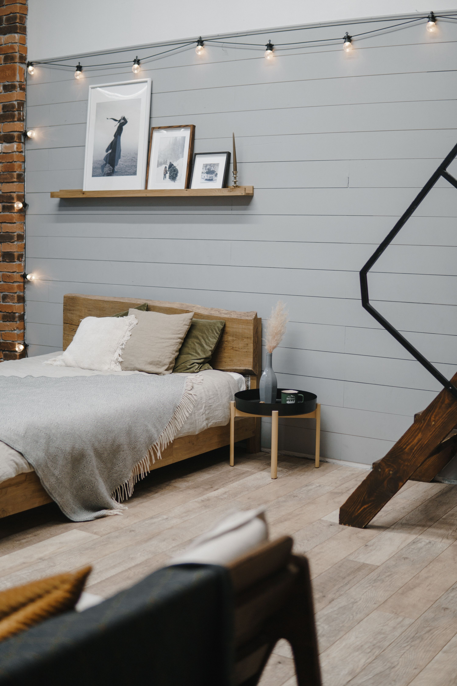
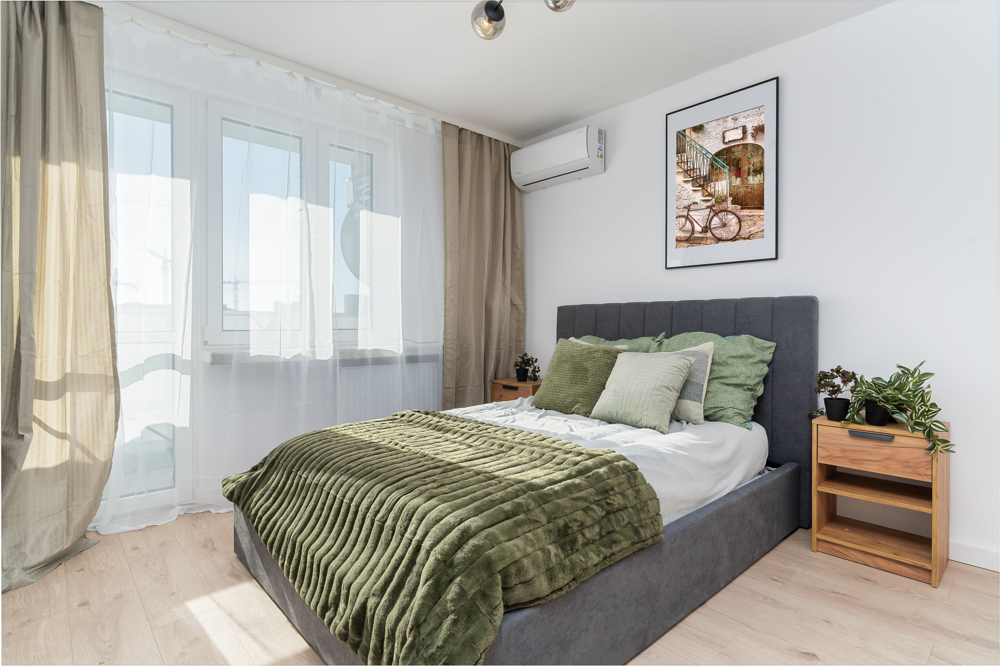

Sypialnia to jedyne miejsce w domu, w którym spędzasz aż jedną trzecią swojego życia. **Chcesz wiedzieć jak urządzić sypialnię? Zacznij od układu.** Przekonasz się, że **dobra aranżacja sypialni sprawi, że zasypiasz szybciej**, a całe wnętrze uspokaja, regeneruje i sprawia, że każdy ranek zaczyna się lepiej.

Z kolei źle urządzona przestrzeń to codzienne zmęczenie, ból pleców i wrażenie, że czegoś w niej brakuje. W tym artykule zebrałam wszystko, co faktycznie działa: konkretne wymiary, odpowiednie kolory, zasady doboru mebli i pomysły, które świetnie sprawdzają się zarówno w dużych, jak i małych wnętrzach.

## Zasady harmonijnej sypialni - od czego zacząć

Zanim kupisz cokolwiek, zmierz pokój. Zapisz wymiary ścian, lokalizację okien, drzwi, gniazdek i grzejnika. To one zdecydują, gdzie stanie łóżko - nie katalog z meblami. Aby mądrze **urządzić funkcjonalną sypialnię**, przemyśl jej docelowy układ. Dobrze **urządzona sypialnia powinna** być podzielona na strefy: strefa snu (łóżko, **stoliki nocne**), strefa przechowywania (szafa lub garderoba, komoda) i ewentualnie mały kącik relaksu - fotel z lampką przy oknie wystarczy, żeby pomieszczenie sypialni wymknęło się ze schematu “tylko do spania”.

Jeśli planujesz samodzielnie **zaprojektować sypialnię**, zwróć uwagę na ergonomię. Prawidłowo **urządzona sypialnia powinna** spełniać kilka podstawowych warunków. Łóżko powinno przylegać zagłówkiem do solidnej ściany - najlepiej naprzeciwko drzwi lub prostopadle do wejścia. Unikaj ustawiania go bezpośrednio pod oknem (przeciągi) ani na wprost drzwi. Wokół łóżka musisz zachować minimum 60 cm wolnej przestrzeni, żeby można było swobodnie wstać i skorzystać z szafki nocnej po obu stronach.

## Wybór łóżka i materaca - serce każdej sypialni

Wybór łóżka to pierwsza i najważniejsza decyzja. Rama łóżka powinna być dopasowana do metrażu pomieszczenia i wzrostu osób, które będą z niego korzystać. Wybierz odpowiednie łóżko zgodnie z tą zasadą: długość powinna być o minimum 20 cm większa niż wzrost najwyższego domownika.

**Wielkość łóżka a liczba użytkowników:**

Dla pary złotym standardem jest 160×200 cm - daje każdej osobie 80 cm szerokości i niezależność ruchów w nocy. Rozmiar 140×200 cm to tylko 70 cm na osobę: w mniejszej sypialni jest to często kompromis. Łóżko 180×200 cm i większe sprawdza się w przestronnych wnętrzach. Łóżka jednoosobowe mają standardowo 90×200 lub 120×200 cm.

Łóżko z tapicerowanym zagłówkiem świetnie sprawdzi się w każdej sypialni, niezależnie od stylu - miękki element dodaje przytulności i jest wygodny podczas czytania. Rama drewniana lepiej zachowuje proporcje w małym wnętrzu, bo dodaje zaledwie 2–6 cm po bokach zamiast 10–15 cm przy tapicerce. Wygodne łóżko kontynentalne o wysokości 60–70 cm ułatwia wstawanie osobom z problemami z kręgosłupem lub kolanami.

Wybór materaca to kwestia zdrowotna, nie estetyczna - dobry materac służy 8–10 lat. Materace z pianki memory foam dopasowują się do krzywizn kręgosłupa i sprawdzają się u alergików. Materace kieszeniowe tłumią przenoszenie ruchów między partnerami, co jest kluczowe, gdy jedno z was wstaje wcześnie. Materace lateksowe mają właściwości antybakteryjne i punktową elastyczność. Przy wyborze zwróć uwagę na swoją pozycję snu: na boku potrzeba miękkiego, na plecach - twardszego materaca.

## Kolory do sypialni - spokój i relaks zamiast chaosu

Aby urządzić przytulną sypialnie musisz zwrócić uwagę na odpowiedni kolor ścian. To jeden z kluczowych elementów wystroju sypialni, który wpływa bezpośrednio na jakość snu. Kolory do sypialni powinny być stonowane i desaturowane - odcienie beżu, ciepłej szarości, bieli z nutą ecru, zieleni (szałwia, oliwka), delikatnego błękitu lub lawendy działają wyciszająco na układ nerwowy.

Jasne kolory optycznie powiększają przestrzeń sypialni i sprawdzają się szczególnie w małej sypialni. Jeśli chcesz dobrać kolory ścian z charakterem - zdecyduj się na mocniejszy akcent za łóżkiem: butelkowa zieleń, granat czy chabrowy tworzą świetne tło dla zagłówka bez przytłaczania całego wnętrza. Ciemne odcienie jak antracyt, grafit czy głęboka zieleń dodają przytulności, ale wymagają dobrego oświetlenia i jasnych akcentów w postaci pościeli czy zasłon.

**Czego unikać:** intensywnych nasyconych barw (czerwień, pomarańcz, żółć) na dużych powierzchniach - pobudzają układ nerwowy i utrudniają zasypianie. W kolory mebli warto inwestować bardziej niż w kolor ścian, bo ściany można przemalować, a meble zostają na lata. Jasne drewno, biały lakier i naturalne odcienie lnu to rozwiązania ponadczasowe.

## Meble do sypialni - wybór i rozmieszczenie

Wybór mebli do sypialni zaczyna się od szafy. Przechowywanie w sypialni to temat, który decyduje o tym, czy po roku pokój wciąż wygląda jak na zdjęciu, czy jak magazyn. Zabudowana szafa wzdłuż jednej ściany, sięgająca do sufitu, to najefektywniejsze rozwiązanie: maksymalna pojemność bez marnowania miejsca pod sufitem.

Szafy z przesuwnymi drzwiami szczególnie świetnie sprawdzają się w małej sypialni - nie zabierają miejsca przy otwieraniu. Lustrzane fronty szafy pełnią dwie funkcje: powiększają optycznie wnętrze i zastępują osobne lustro. Jeśli masz możliwość, mini garderoba wydzielona z 1,5 m szerokości ściany to inwestycja, która zmienia codzienne funkcjonowanie.

W małej sypialni absolutną koniecznością jest łóżko z pojemnikiem - szuflady lub podnoszony stelaż na pościel. To rozwiązanie, które w budżecie małego mieszkania potrafi uratować sytuację. Stoliki nocne powinny być symetrycznie ustawione po obu stronach łóżka - symetria uspokaja wizualnie przestrzeń i zapewnia obojgu partnerom równy dostęp do lampki i miejsca na telefon. W małej sypialni zamiast klasycznych szafek nocnych sprawdzą się wiszące półki lub kinkiety ze zintegrowaną półką.

Komoda to niezwykle przydatny mebel w sypialni - miejsce na bieliznę i drobiazgi bez konieczności grzebania w szafie. Wybieraj wyższe i węższe modele - dają więcej pojemności przy mniejszym footprincie. Toaletka lub lekka konsolka z lusterkiem przydaje się do makijażu i sprawdza się przy naturalnym świetle.

**Podłoga w sypialni** powinna być cicha, przyjemna w dotyku i antystatyczna. Panele podłogowe laminowane to dziś doskonała alternatywa dla parkietu - wytrzymałe, ciche i dostępne w setkach wzorów imitujących naturalne drewno.

## Oświetlenie warstwowe - fundament przytulności

Największy błąd w oświetleniu sypialni to jedna lampa na środku sufitu. Dobrze oświetlona sypialnia potrzebuje oświetlenia warstwowego: kilku niezależnych źródeł dopasowanych do różnych funkcji pomieszczenia.

**Warstwa ogólna** to ciepłe (2700–3000 K), ściemniane światło sufitowe - plafon, lampa z rozproszonym kloszem lub oświetlenie wpuszczone w sufit podwieszany. **Warstwa zadaniowa** to kinkiety przy łóżku, montowane 60–75 cm nad materacem. Zamiast lampek nocnych na stoliku, kinkiety ścienne dają stłumione, kierunkowe światło i zwalniają blat szafki nocnej. Włączniki powinny znajdować się po obu stronach łóżka. **Warstwa nastrojowa** to listwy LED za zagłówkiem, lampki z ciepłym żarnikiem lub lampa podłogowa ze ściemniaczem - elementy, które budują atmosferę wieczornego wyciszenia.

Wszystkie źródła światła w sypialni warto wyposażyć w ściemniacz lub kilka poziomów jasności. Wieczorne przygotowanie do snu wymaga zupełnie innego natężenia niż poranki.

## Style aranżacji sypialni

Aranżując sypialnię, warto wybrać jeden spójny styl i trzymać się go konsekwentnie - mieszanie zbyt wielu estetyk tworzy chaos, który nie sprzyja wyciszeniu.

**Styl skandynawski** bazuje na jasnym drewnie, bieli, lnianych tekstyliach i roślinach. Tapicerowany zagłówek w neutralnym kolorze, pościel z lnu lub bawełny, kilka doniczek z eukaliptusem lub sukulentami - to przepis na wnętrze spokojne i ponadczasowe.

**Styl boho** to ciepłe ziemiste kolory, rattan, makramy na ścianie, dywany plecione z juty i rośliny w każdym kącie. Naturalne materiały, haftowane poduszki i rattanowe kosze doskonale nadają się do przechowywania z charakterem. Miękkie tkaniny w sypialni boho tworzą przytulny, egzotyczny klimat.

**Styl klasyczny** stawia na symetrię, parzyste lampki i eleganckie materiały - aksamit, satyna, drewno w ciepłych tonach. Stonowana kolorystyka w beżach i szarościach z dodatkiem bordo. Styl klasyczny jest ponadczasowy, ale wymaga starannego doboru każdego elementu.

**Styl nowoczesny** to minimalistyczna aranżacja sypialni z czystymi liniami, geometrią i monochromatyczną paletą. Nowoczesna sypialnia lubi porządek - każdy mebel i dekoracja mają funkcję. Jeden wyrazisty akcent kolorystyczny (granat, butelkowa zieleń, turkus) przełamuje minimalistyczne tło.

**Styl glamour** łączy połysk złotych lub mosiężnych akcentów z miękkością tapicerowanych zagłówków i aksamitnej pościeli. Postaw na pudrowy róż lub przetartą zieleń wzbogaconą złotymi detalami - puchowy dywan i lustra w zdobnych ramach dopełnią wystrój.

**Feng shui w sypialni** to filozofia, która realnie wpływa na jakość snu. Ustaw łóżko tak, by widzieć wejście do pomieszczenia - nie musi stać idealnie na wprost drzwi. Unikaj luster naprzeciwko łóżka. Wprowadź rośliny o miękkich liściach (bez kolców i ostrych krawędzi). Postaw na naturalne materiały - drewno, len, bawełna. Harmonię buduje symetria po obu stronach łóżka i minimalizm w widocznej części pomieszczenia.

## Jak urządzić małą sypialnię - sprawdzone wskazówki

Urządzić niewielką sypialnię tak, by była funkcjonalna i przytulna, to jedno z częstszych wyzwań. Mała kwadratowa sypialnia wymaga szczególnej uwagi przy ustawianiu mebli - bez wyraźnie dłuższej ściany trudno zachować dostęp do łóżka z obu stron. Rozwiązanie: dosuń jeden bok do ściany, zachowując 60–80 cm ciągu po drugiej stronie.

W małej sypialni warto przemyśleć każdy metr kwadratowy. Jasne kolory ścian i mebli rozświetlą i optycznie powiększą wnętrze. Łóżko z pojemnikiem jest koniecznością. Szafa z przesuwnymi drzwiami zaoszczędza mnóstwo miejsca. Lustra lub szafa z lustrzanymi frontami wizualnie podwajają przestrzeń. W małej sypialni powinny znaleźć się tylko meble niezbędne - komoda zamiast pełnej garderoby, wiszące półki zamiast szafek nocnych.

Rośliny w sypialni działają dobrze nawet w małych wnętrzach - monstera, zamiokulkas, skrzydłokwiat nie zajmują dużo miejsca, oczyszczają powietrze i ożywiają aranżację. Unikaj roślin z kolcami lub ostrymi krawędziami.

**Sypialnia na poddaszu** ze skosami to wbrew pozorom bardzo klimatyczne miejsce do spania. Łóżko pod skosem jest możliwe, jeśli ścianka kolankowa ma minimum 90–110 cm. Skosy zabuduj meblami na wymiar - to jedyne sensowne rozwiązanie.

## Tekstylia do sypialni - szczegóły, które robią różnicę

Tekstylia do sypialni to najprostszy sposób na zmianę atmosfery bez remontu. Miękkie tkaniny w sypialni - pościel, zasłony, dywan i poduszki - budują klimat równie skutecznie jak meble.

Pościel z bawełny egipskiej lub lniana jest inwestycją w jakość snu. Zasłony zaciemniające (blackout) lub rolety to konieczność dla tych, którzy chcą spać spokojnie po wschodzie słońca. Długie zasłony sięgające podłogi nadają sypialni elegancję i optycznie podnoszą sufit.

Dywan przy łóżku sprawia, że rano wstajesz na coś miękkiego i ciepłego. Wystarczy model obejmujący dwie trzecie szerokości łóżka, wystający 60 cm po obu stronach. Poduszki ozdobne w zróżnicowanych fakturach, narzuta dopasowana do koloru ścian i mebli, kilka świec - to drobne elementy wystroju sypialni, które kompletują obraz całości.

Unikaj odkrytych półek zastawionych bibelotami - kurz i chaos wizualny nie sprzyjają wyciszeniu. Ozdobienie ściany sypialni jednym dużym obrazem lub dwoma mniejszymi nad zagłówkiem jest znacznie lepszym pomysłem niż dziesiątki drobiazgów rozrzuconych po całym pokoju.

Wymarzona sypialnia nie musi być efektem dużego budżetu ani całkowitego remontu. Warto przemyśleć kolejność: najpierw łóżko i układ mebli, potem kolory, oświetlenie i tekstylia - a dekoracje zawsze na końcu, kiedy masz już pełen obraz całości. Sypialnia, w której naprawdę odpoczywasz, jest warta każdej przemyślanej decyzji.